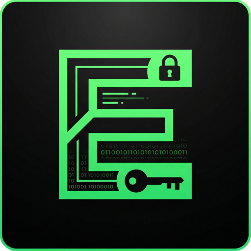
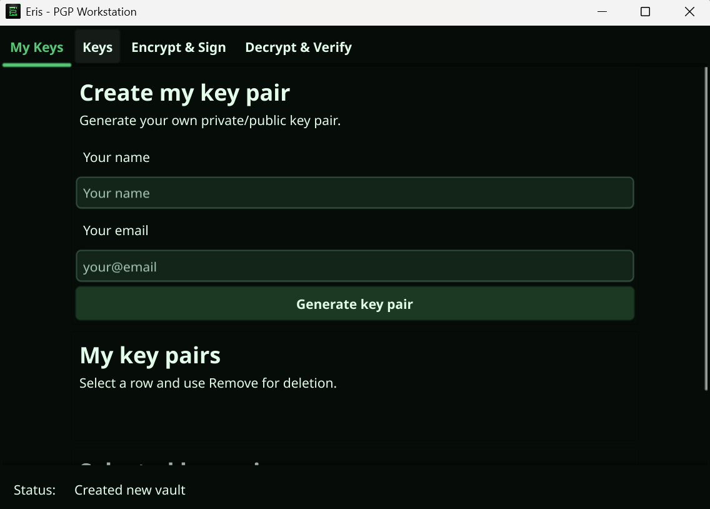
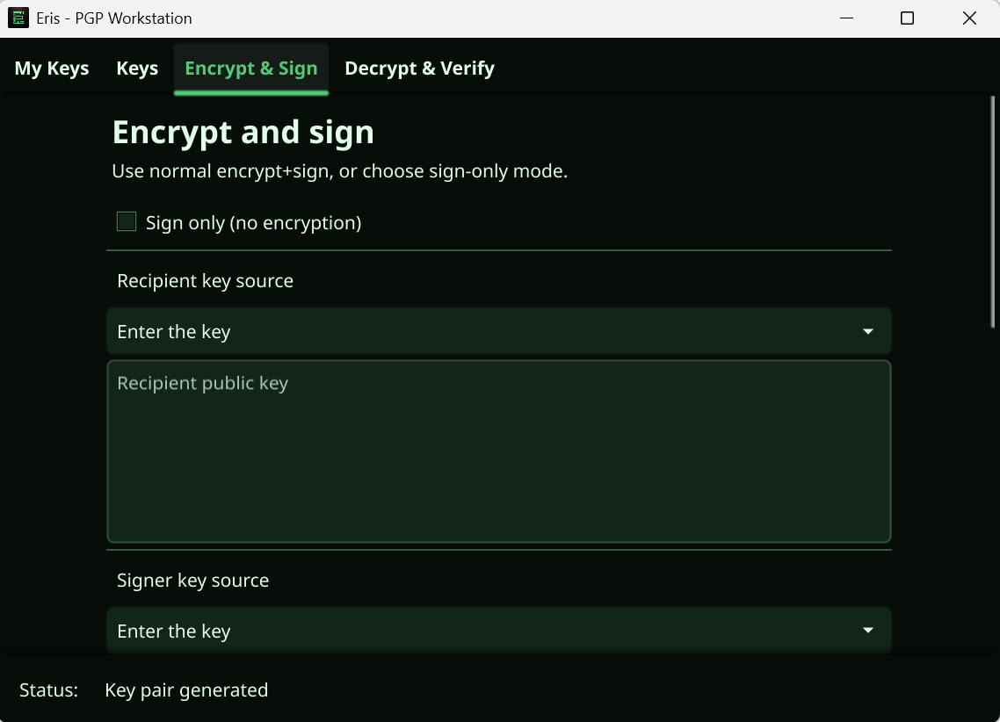

 

[](https://www.producthunt.com/products/eris)


 [](https://goreportcard.com/report/github.com/sibexico/Eris)
 [](https://sibexi.co/support)

# Eris





Eris is a desktop PGP workstation written in Go with Fyne.
It stores keys in an encrypted vault and gives you a clean UI for signing, encryption, decryption, and verification.

## Features
- Encrypted vault file
- Owner key pair generation and contact public key import
- Encrypt + sign, decrypt + verify
- Sign-only and verify-only message modes
- Dark high-contrast GUI theme

## Build

Windows:
```powershell
go build -ldflags "-H=windowsgui" -o eris.exe .
```

Linux:
```bash
go build -o eris .
```

## Run
- Windows: `./eris.exe`
- Linux: `./eris`

## Screenshots



