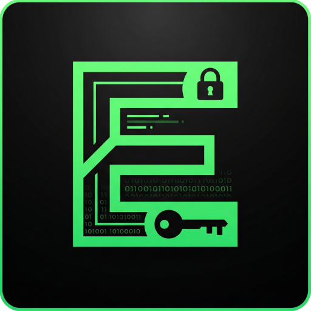
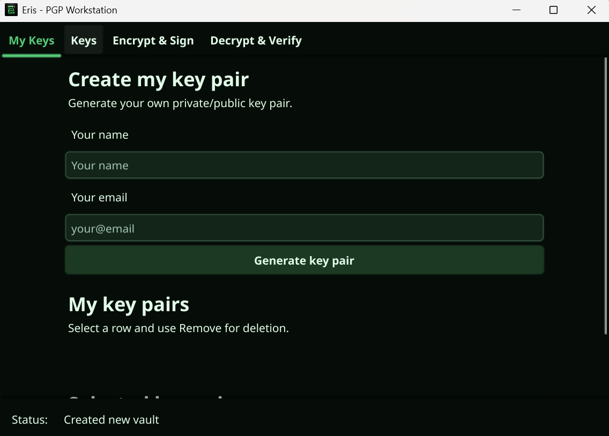
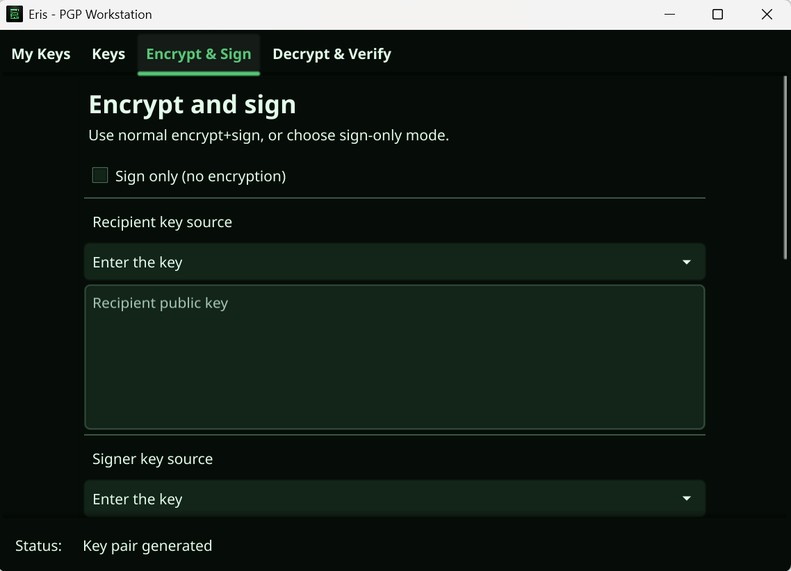

 


 [](https://goreportcard.com/report/github.com/sibexico/Eris)
 [](https://sibexi.co/support)

[](https://github.com/sibexico/Eris/actions/runs/25575542169)
 [](https://github.com/sibexico/Eris/actions/runs/25575542169)

# Eris





Eris is a desktop PGP workstation written in Go with Fyne.
It stores keys in an encrypted vault and gives you a clean UI for signing, encryption, decryption, and verification.

## Features
- Encrypted local vault for stored keys
- Generate your own key pairs
- Import and manage contact public keys
- Encrypt and sign messages
- Decrypt and verify incoming messages
- Dedicated sign-only and verify-only modes
- Settings tab for switching vaults and changing vault passphrase

## Install

### Windows (Winget)

Install from WinGet with:

```powershell
winget install sibexico.Eris
```

If you already have Eris installed and want the latest published release:

```powershell
winget upgrade sibexico.Eris
```

### Debian/Ubuntu (.deb from Release)

1. Open the latest Release page and download the `.deb` file from Assets.
2. Install it with:

```bash
sudo apt install ./eris_<version>_linux_<arch>.deb
```

Example:

```bash
sudo apt install ./eris_1.2.3_linux_x86_64.deb
```

If your distribution prefers `dpkg` first:

```bash
sudo dpkg -i eris_<version>_linux_<arch>.deb
sudo apt -f install
```

## Build

Build from source if you want a local binary:

Windows:
```powershell
go build -ldflags "-H=windowsgui" -o eris.exe .
```

Linux:
```bash
go build -o eris .
```

## Run
- Windows: `./eris.exe`
- Linux: `./eris`

## Screenshots




